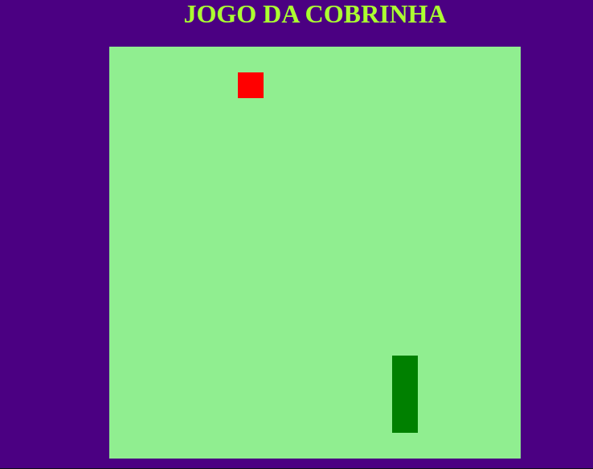

<h1 align='center'>Jogo Snake Clássico</h1>

<p align='center'>

</p>
</br>


1.  Jogo clássico da cobrinha feito com JavaScript, **explorando a família da função nativa ```Math()``` do javascript** , além do uso do canvas para renderização 2D. 
2.  Estilizado com CSS puro (Sem uso de Frameworks de estilização). 
3.  Para rodar, basta ter o arquivo HTML em seu computador e abri-lo com o navegador da sua preferência. Agora é só jogar!!


